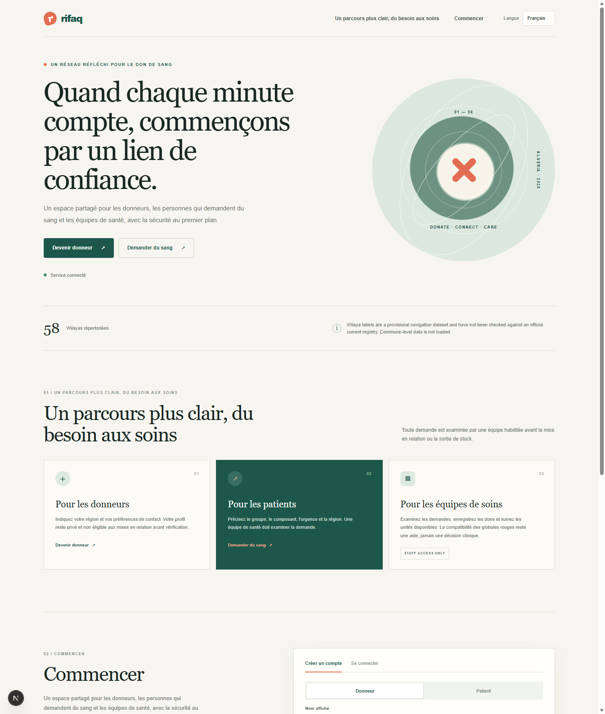
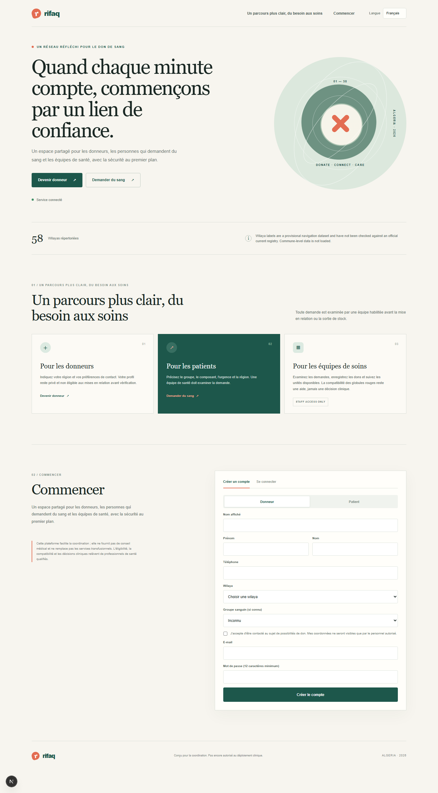

<div align="center">
  <h1 style="color:#1d574b">Rifaq · Blood Donation Coordination</h1>
  <p><strong>A multilingual technical platform for coordinating blood donation and blood-bank workflows in Algeria.</strong></p>
  <p><em>Technical foundation only — not a medical device, transfusion service, or authorization for clinical use.</em></p>
</div>

<p align="center">
  <a href="#screenshots">Screenshots</a> ·
  <a href="#run-locally-on-windows">Run locally</a> ·
  <a href="#create-staff-and-admin-logins">Staff and admin logins</a> ·
  <a href="#deploy-to-a-website">Deploy</a> ·
  <a href="docs/REAL_WORLD_READINESS.md">Readiness and limitations</a>
</p>

<p align="center">
  <span style="background:#1d574b;color:white;padding:5px 9px;border-radius:12px">Laravel 13 API</span>
  <span style="background:#1d574b;color:white;padding:5px 9px;border-radius:12px">Next.js 16</span>
  <span style="background:#1d574b;color:white;padding:5px 9px;border-radius:12px">Arabic · French · English</span>
</p>

**Search topics:** Algerian blood donation · blood bank management system · donor coordination · Laravel API · Next.js · Arabic · French · English

## Project at a glance

Rifaq is a database-backed application foundation that brings donors, people requesting blood, and healthcare teams into one coordination workflow. It provides a multilingual web portal and a Laravel API for donor profiles, blood requests, authorized review, facilities, donation records, red-cell candidate matching, inventory, notifications, and audit events.

**Important:** the application supports technical coordination and screening aids only. Qualified healthcare professionals must independently confirm donor eligibility, blood group, compatibility, inventory suitability, and every clinical decision. Do not use it to make or authorize a transfusion decision.

## Screenshots

The images below were captured from the locally running application with reference data loaded. They contain no real patient or donor records.

<table>
  <tr>
    <td align="center"><strong>French landing page</strong></td>
    <td align="center"><strong>Full-page preview, including account creation</strong></td>
  </tr>
  <tr>
    <td></td>
    <td></td>
  </tr>
</table>

## Features and how to use them

| User | Main workflow |
| --- | --- |
| **Donor** | Create a donor account, choose a wilaya and known blood group, opt in or out of contact, and set availability. A donor cannot self-verify their identity or medical eligibility. |
| **Recipient** | Create an account and submit a blood request with component, blood group, urgency, location, and requested units. A request starts pending healthcare review. |
| **Staff** | Sign in to the operations view, review requests and donor profiles for assigned facilities, record donations, follow their screening status, review matching candidates, and track inventory. |
| **Administrator** | Sign in to the operations view and use protected administrator API operations for facilities, staff assignments, and audit records. Facility verification and staff assignment do not currently have dedicated forms in the web portal. |

The browser portal is served from `/` (normally `http://localhost:3000`). Use its **Create account** and **Sign in** controls; there is no separate dashboard URL. Operations panels are shown after a provisioned staff or admin account signs in.

The matching implementation is deliberately limited to basic red-cell ABO/Rh candidate rules, location, donor consent, availability, and staff-managed flags. It is not a clinical compatibility assessment. See [Real-world readiness and limitations](docs/REAL_WORLD_READINESS.md) before testing operational features.

## Technology

| Layer | Technologies |
| --- | --- |
| Web client | Next.js 16, React 19, TypeScript, responsive CSS, Tailwind CSS 4 |
| API | PHP 8.3+, Laravel 13, Laravel Sanctum bearer-token authentication |
| Data | PostgreSQL for shared deployments; SQLite is the convenient local default |
| Tests and quality | PHPUnit feature/unit tests, Laravel Pint, ESLint, Next.js production build |
| Languages | Arabic (RTL), French, and English |

The repository does not include a Docker deployment definition, a production hosting configuration, or a preloaded privileged account. Notifications are in-app database records; external email/SMS integrations are not implemented.

## Run locally on Windows

### 1. Install prerequisites

- PHP 8.3 or newer with the `pdo_sqlite` extension enabled for the SQLite setup below.
- Composer 2.
- Node.js 22 or newer and npm.
- PowerShell.

Check that the tools are on your `PATH`:

```powershell
php -v
composer --version
node --version
npm --version
```

### 2. Configure and start the API

Open **PowerShell window 1**, go to the project folder, then prepare Laravel:

```powershell
Set-Location 'C:\path\to\algerian-blood-bank\backend'
Copy-Item .env.example .env
composer install
if (-not (Test-Path database\database.sqlite)) {
    New-Item -ItemType File -Path database\database.sqlite | Out-Null
}
php artisan key:generate
php artisan migrate --seed
php artisan serve
```

Keep this terminal open. Laravel should report that it is serving at `http://127.0.0.1:8000`. The checked-in example configuration uses SQLite. If you prefer PostgreSQL locally, create a database and update `DB_CONNECTION`, `DB_HOST`, `DB_PORT`, `DB_DATABASE`, `DB_USERNAME`, and `DB_PASSWORD` in `backend\.env` before running migrations.

Check the API in a browser: <http://localhost:8000/api/v1/reference-data>. A JSON response containing blood types, components, and provisional wilaya labels means the API is reachable.

### 3. Configure and start the web app

Open **PowerShell window 2**:

```powershell
Set-Location 'C:\path\to\algerian-blood-bank\frontend'
Copy-Item .env.example .env.local
npm ci
npm run dev
```

Keep this terminal open and visit <http://localhost:3000>. `frontend\.env.local` should contain:

```dotenv
NEXT_PUBLIC_API_BASE_URL=http://localhost:8000/api/v1
```

`backend\.env` should allow the exact frontend origin:

```dotenv
CORS_ALLOWED_ORIGINS=http://localhost:3000
```

If you use `127.0.0.1` instead of `localhost`, keep the hostname consistent and add the exact browser origin to `CORS_ALLOWED_ORIGINS`. Restart the relevant server after changing environment files. `NEXT_PUBLIC_` settings are included in the browser build and must never contain secrets.

### 4. Create staff or admin test accounts

There are intentionally **no default accounts or shared passwords**. Public registration creates donor or recipient users only; it cannot grant staff/admin roles.

In another PowerShell window, provision a local administrator from the backend directory:

```powershell
Set-Location 'C:\path\to\algerian-blood-bank\backend'
php artisan app:create-operator "Local Admin" admin@example.test admin
```

The command asks for a password using a hidden prompt. Use a unique password of at least 12 characters. For staff:

```powershell
php artisan app:create-operator "Local Staff" staff@example.test staff
```

Sign in at <http://localhost:3000> using the email and password you just created. The operations view is part of the same portal. A staff account must also be assigned to a verified facility by an administrator before it can work with facility-scoped requests and donor records. These facility verification and assignment actions use protected admin API endpoints; they do not yet have dedicated portal forms.

A shared, guessable password is not configured and should never be used for privileged accounts. A known shared password would allow anyone who sees the README to take over staff/admin access.

### 5. Try the donor and recipient journeys

1. Use **Create account** to register a donor or recipient.
2. For a donor, choose a wilaya and (if known) a blood group. Donor contact permission is opt-in. Sign in later to change contact consent or availability.
3. For a recipient, submit a request. It remains pending until authorized staff review it.
4. Sign in as staff/admin to access the operations area. Donor review flags must only be confirmed after the facility's required checks; the software does not perform identity or medical screening.
5. Use synthetic data only while evaluating the application. Do not enter real patient or donor health information into an unapproved deployment.

## Deploy to a website

This is a deployment outline for a **server you administer**, not a one-click hosting recipe. The repository does not provide Docker Compose, Terraform, a production Nginx configuration, managed database provisioning, or a hosting account. A static-only website host cannot run the Laravel API; deploy the API and Next.js server separately or use a VPS that can run both. Have an experienced operator configure and maintain the infrastructure.

### Production architecture

- A domain with HTTPS/TLS, routed through a maintained reverse proxy such as Nginx.
- Laravel API on PHP-FPM with the required PHP extensions and Composer production dependencies.
- Next.js production server running under a process supervisor (for example systemd) or a managed Node.js service.
- Managed PostgreSQL or a properly secured PostgreSQL server with backups and tested recovery.
- Environment-specific secrets stored in the host's secret manager or protected environment files, never in source control or frontend variables.

### Deployment checklist

1. Provision the host, domain, TLS, PostgreSQL database, firewall, backups, monitoring, and a non-root deployment account. Restrict database access to the API host and validate recovery from backups.
2. Deploy the repository and configure the backend environment with `APP_ENV=production`, `APP_DEBUG=false`, a unique `APP_KEY`, the production `APP_URL`, PostgreSQL connection values, and `CORS_ALLOWED_ORIGINS` set to the exact HTTPS web origin. Configure secrets outside the repository.
3. Install backend production dependencies and apply migrations:

   ```sh
   cd backend
   composer install --no-dev --prefer-dist --optimize-autoloader
   php artisan migrate --force
   php artisan config:cache
   php artisan route:cache
   ```

   Seed reference data only when appropriate for the environment: review `php artisan db:seed --class=ReferenceDataSeeder` and the [geographic data limitations](docs/REAL_WORLD_READINESS.md) first. Do not use destructive `migrate:fresh` against a deployment database.
4. Build and run the frontend as a long-lived Node.js service:

   ```sh
   cd frontend
   npm ci
   # Set NEXT_PUBLIC_API_BASE_URL to the public HTTPS API base before building.
   npm run build
   npm run start
   ```

   Set `NEXT_PUBLIC_API_BASE_URL` to a URL such as `https://api.example.org/api/v1` before `npm run build`. It is public browser configuration, not a secret. Restart the process after deployment and supervise it so it comes back after a reboot.
5. Configure the reverse proxy to send web requests to the Next.js service and API requests to Laravel/PHP-FPM. Enforce HTTPS, restrict allowed origins, set secure production headers, configure request size/rate limits, and test CORS from the actual website origin.
6. Provision named staff/admin operators on the server with `php artisan app:create-operator`; use the hidden password prompt and an approved identity-check process. Verify facilities and assign staff only through authorized procedures.
7. Before any real-world use, complete the clinical, legal/privacy, security, operational, localization, data-provenance, and emergency-readiness reviews listed in [`docs/REAL_WORLD_READINESS.md`](docs/REAL_WORLD_READINESS.md).

**Not approved for live healthcare operations:** successful tests or deployment do not constitute Algerian medical, legal, regulatory, cybersecurity, or operational authorization. The 58 seeded wilaya labels are provisional navigation data, not verified official data; commune-level data is absent. ABO/Rh matching is only a technical screening aid, not clinical validation.

## Troubleshooting

| Symptom | Check |
| --- | --- |
| “API inaccessible” / region choices do not load | Confirm the Laravel terminal is still running; test <http://localhost:8000/api/v1/reference-data>; check `NEXT_PUBLIC_API_BASE_URL` and exact `CORS_ALLOWED_ORIGINS`; restart the relevant process. |
| API returns a database error | Confirm `backend\.env` points at an existing SQLite file (or a running PostgreSQL database), then run `php artisan migrate --seed`. |
| Admin/staff login fails | No built-in privileged login exists. Create an account using `php artisan app:create-operator` and use the email/password entered during provisioning. |
| Staff sees no assigned-area records | Ensure an administrator has verified a facility and assigned the staff user to it; confirm both use the expected wilaya. |
| Changes to `.env.local` have no effect | Stop and restart `npm run dev`; `NEXT_PUBLIC_` values are read by Next.js when it starts/builds. |

## Development checks

Run from the project root in PowerShell:

```powershell
Set-Location backend
php artisan test
vendor\bin\pint --test

Set-Location ..\frontend
npm run lint
npm run build
```

The PostgreSQL workflow is configured in CI; local SQLite checks do not prove that a production PostgreSQL deployment has been validated. Refer to [real-world readiness and limitations](docs/REAL_WORLD_READINESS.md) for the full boundary between implemented software and outstanding real-world prerequisites.
